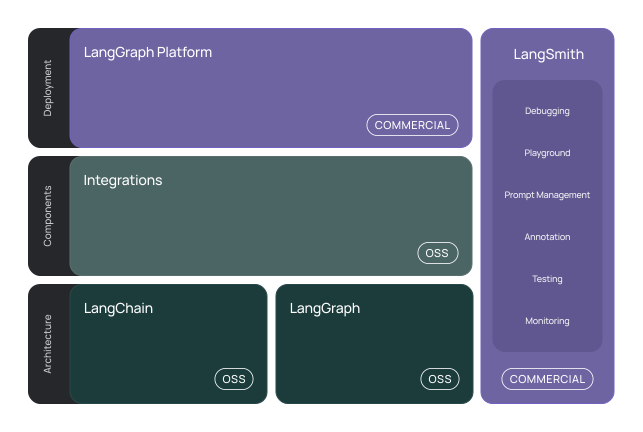
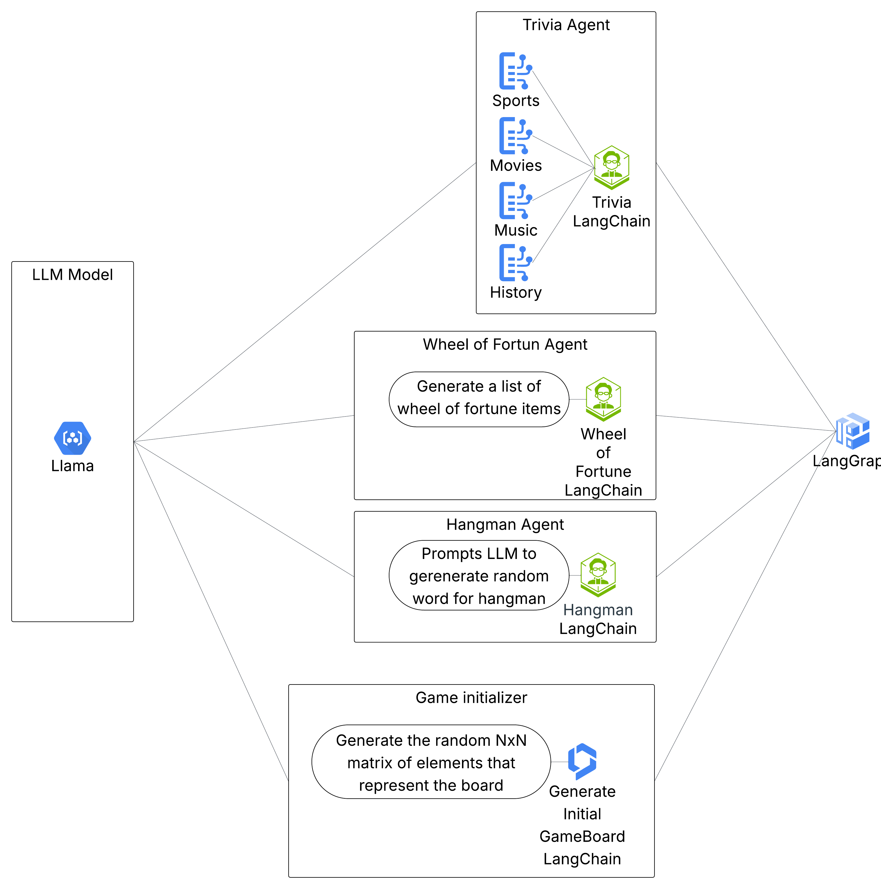

### LangChain

LangChain is a framework for developing applications powered by large language models (LLMs).

LangChain simplifies every stage of the LLM application lifecycle:

* **Development:** Build your applications using LangChain's open-source components and third-party integrations. Use LangGraph to build stateful agents with first-class streaming and human-in-the-loop support.
* **Productionization:** Use LangSmith to inspect, monitor and evaluate your applications, so that you can continuously optimize and deploy with confidence.
* **Deployment:** Turn your LangGraph applications into production-ready APIs and Assistants with LangGraph Platform.

### Components:

* langchain-core: Base abstractions and LangChain Expression Language.
* langchain-community: Third party integrations.
Partner packages (e.g. langchain-openai, langchain-anthropic, etc.): Some integrations have been further split into their own lightweight packages that only depend on langchain-core.
* langchain: Chains, agents, and retrieval strategies that make up an application's cognitive architecture.
* langgraph: Build robust and stateful multi-actor applications with LLMs by modeling steps as edges and nodes in a graph.
* langserve: Deploy LangChain chains as REST APIs.
The broader ecosystem includes:

* LangSmith: A developer platform that lets you debug, test, evaluate, and monitor LLM applications and seamlessly integrates with LangChain.
### StairCase LangGraph Implementation
For this game we decided to implement 4 different langchain agents. One that handles Trivia minigame, one for Hangman, one for wheel of fortune, and one to iniriate the game board.

