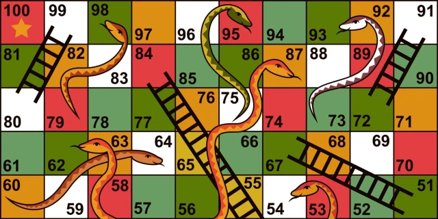

### <span style="color: green">Staircase</span>

WebURL: https://stair-case.vercel.app/

### <span style="color: green">Group Members</span>
Ashkan Nikfarjam, Brendan Ly 

### <span style="color: green">Staircase</span>

This is an ancient Persian game bringing friends and family together. We decided to develop this game for PC and Mac to allow people to play together and bring the old memories of this game back. We are excited to see how we can tie all of our skills together to make a full stack game, and get to experience other people’s joy of the game. We hope to develop our full stack game development utilizing langchain and lang graph to leverage LLMs to develop our game application with. 

### <span style="color: green">Dependencies</span>
pygame
flask
flask-cors
firebase-admin
python-dotenv
requests
langchain-core
numpy
### <span style="color: green">Setup Instructions</span>
To run this game locally, clone the project and move into its root directory
Then, 

Run the backend by running 

╰─ python3 -m BackEnd.stairCase_Server                                                                  ─╯

Then in two seperate terminals, run 

╰─ python3 -m Front_Game_Client.Menue                                                                   ─╯

in each. 

User Need to sign Up in our website to be entered to our database and access the game contents.


Then, invite each other by username if necessary, then start the game.

### <span style="color: green">File Structure OverView</span>
BackEnd/

├── Routers/ # Contains Flask route handlers for game logic

├── stairCase_Server.py # Main Flask server entry point

└── FB_Admin_SDK.json # Firebase configuration for user management

Front_Game_Client/

├── game_client.py # Main Pygame game client implementation

├── Menue.py # Game menu and user interface

└── tests/ # Unit tests for game client

Agent/

├── Ageny.Py # SuperClass for the Agents

├── TriviaLC.py # Trivia minigame implementation using LangChain

├── HangmanLC.py # Hangman minigame implementation using LangChain (unfinished)

└── langChainConfig.py # LangChain configuration and setup

FrontWeb/ # React-based web interface

├── src/ # Source code for web components

graphics/ # Game assets and images

├── blue-sky.png # Background image

└── ground.png # Ground texture

### <span style="color: green">Known Bugs</span>
The Hangman minigames are not fully implemented yet, so their current
functionality is buggy. For example, you may see the Langchain LM give a word returned with a bunch of underscores, making it impossible to guess.

When running the game locally, the user that logins first has to be the first
to hit the "Start Game" button, then the other player can click Start Game and the game will work normally. Otherwise, player 2 will not load. 


### To run the game clienet in terminal in you poject directort run:

```
python3 -m Front_Game_Client.Menue
```
Or simply download it

since the game is deployed to cloud you dont need to run flask server anymore. 
